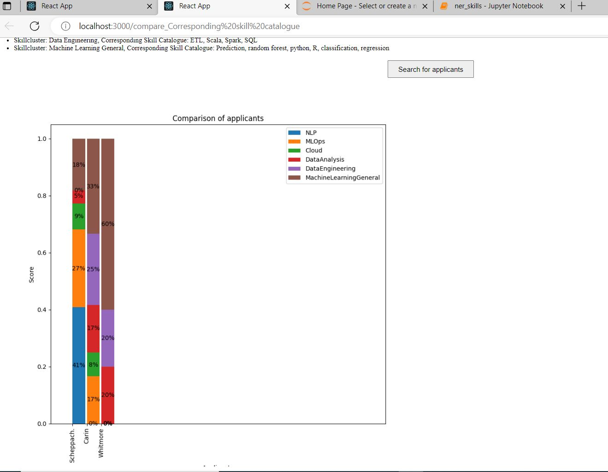

# Introduction:
As an innovation-driven individual, I am excited about the ongoing AI revolution! In particular, the emergence of openAI, Langchain and Vectorstore solutions like Pineccone or ChromaDB has enabled to opportunities for building AI Applications. 
That's why I started this side project exploring the potential of Machine Learning in HR. Here I am working on the creation of competence profiles of applicants (based on CVs), job postings, and entire projects (based on Jira Stories) to enable the best possible matching.

# 1. Keyword-Search:
An exemplary insight into this project is provided by a module for competence screening or competence clustering of CVs, which is currently still in progress and is being developed as a proof of concept, but which immediately demonstrates the potential of vector embedding, especially with the help of large language models.

This feature enables recruiters, HR employees or Managers to analyze applicants regarding some predefines skillclusters and skills which are relevant for open job vaccancies. The recruiter can define skillclusters for which he want to search for and gets visualizations that gives a fast understanding of the skills and strength of an applicant. The user has also the option to sort the applicants according to specific skillclusters.
Currently this Feature was already created a React Flask application and interface , the  Recat is used as Frontend and Flask as the backend and forntend and backend communicate via API's with each other. 

job_resume_tool/output_skillcluster.JPG

The chart shows how strongly the applicants' skills (in percentages) match the skill clusters. As you can immediately see from the chart, the first applicant has a strong background in MLOps, while the second applicant has more experience with Data Engineering. This allows for quick screening of skill sets and their match with various projects and job openings.

# 2. Information Retrieval
For this feature I will utilize language embeddings to measure the cosine distance between a resume and a job description and therefore be able to rank the applicants. Unlike traditional keyword-based approaches that rely solely on matching keywords, language embeddings provide us with a more nuanced understanding of the text by capturing the contextual and semantic meaning.
Language embeddings are representations of words, phrases, or documents in a high-dimensional vector space, where words with similar meanings or contexts are located closer to each other. These embeddings are generated through advanced techniques such as word2vec, GloVe, or BERT, which leverage large amounts of textual data to learn the underlying patterns and relationships between words.

Following jupyter notebook shows a proof-of-concept of this feature: https://github.com/ascheppach/job_resume_tool/blob/main/Information%20Retrieval.ipynb

# 3. NER:
For the creation of employee and project competence profiles, we recommend the use of information extraction algorithms (e.g. Named Entity Recognition) using the spaCy library.
